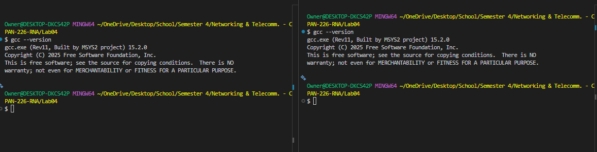
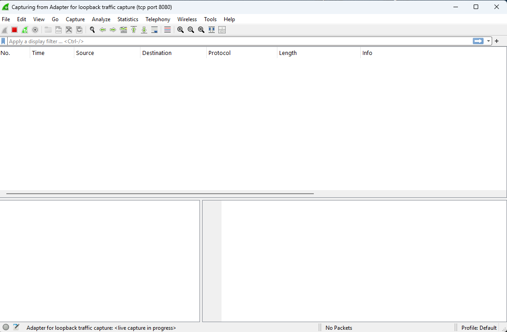
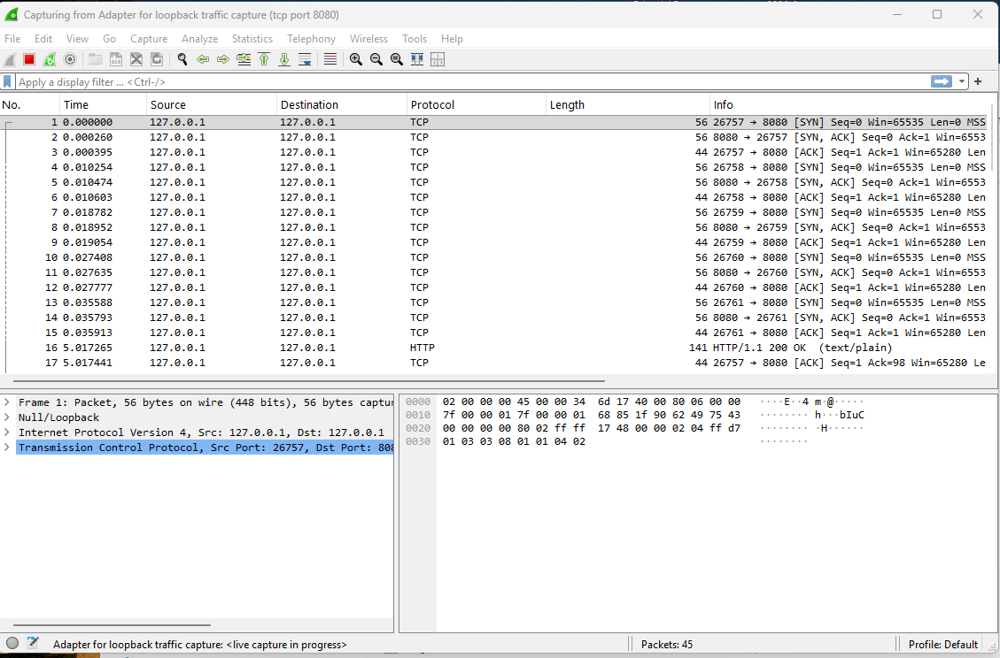
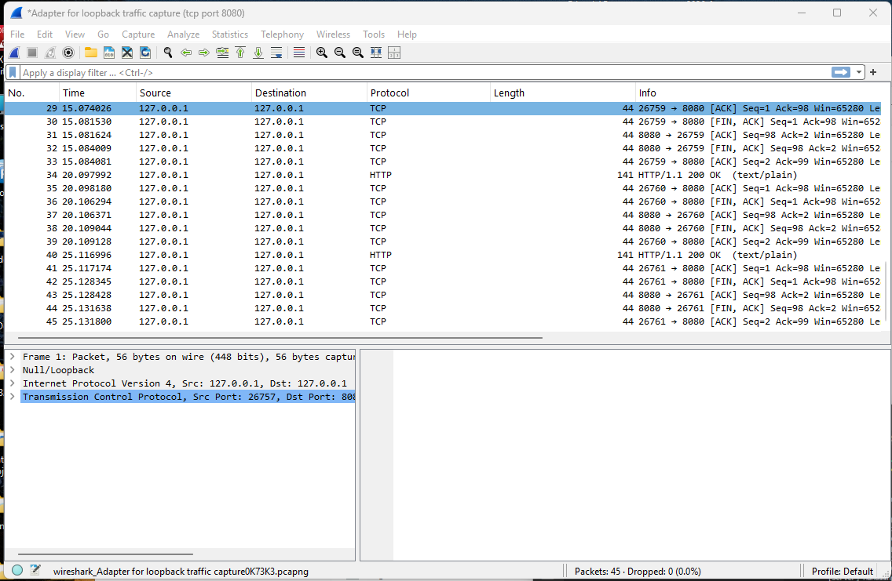
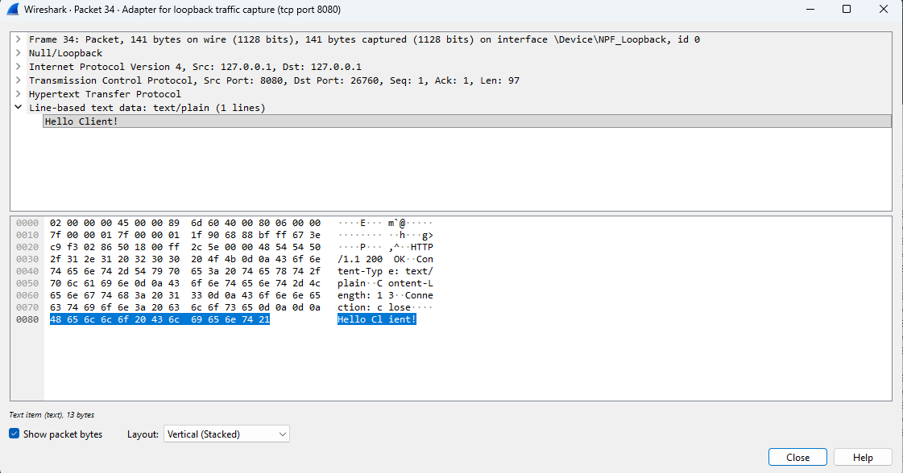
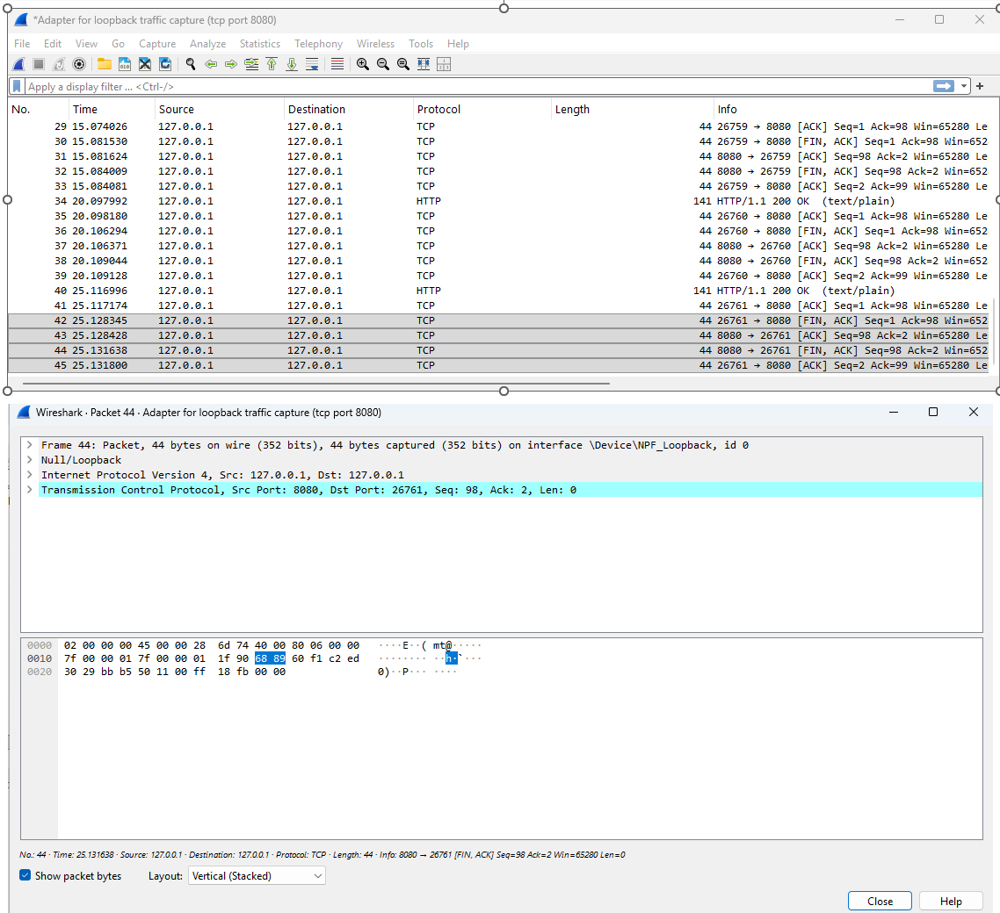
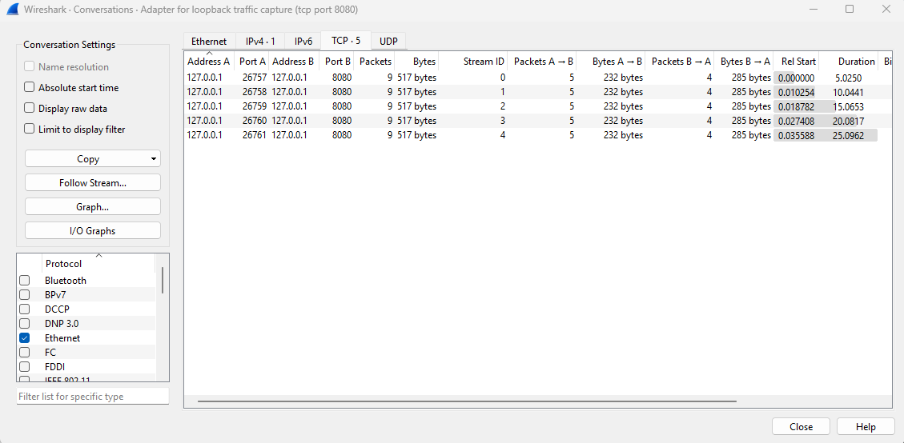
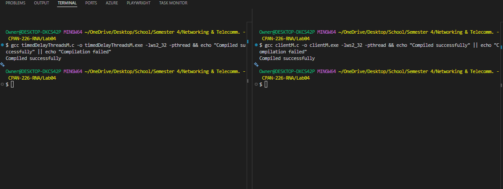
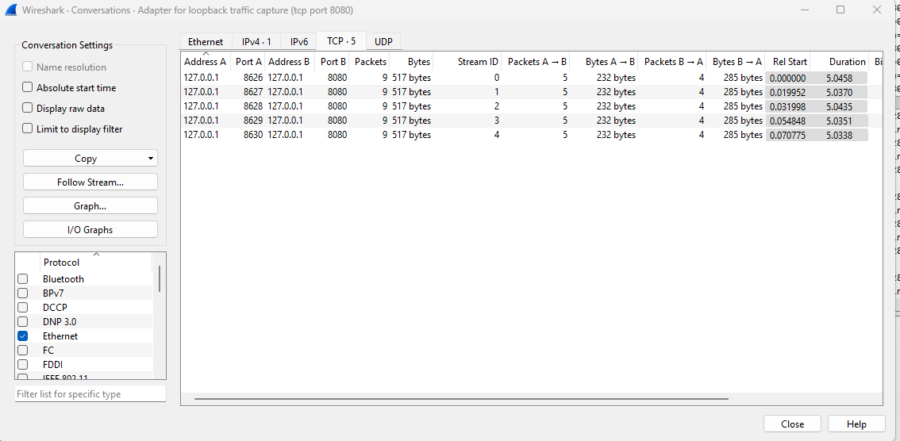

# Lab 4 — Multithreading Lab

**Harry Joseph** | N00881767  
CPAN-226 Networking & Telecommunications  
February 21, 2026

---

## What This Lab Is About

The idea here is simple: take a server that handles clients one at a time, watch it struggle, then fix it with threads and see the difference. The server has a fake 5-second delay per request (simulating something slow like a database call), so when 5 clients hit it at once, the sequential version makes them wait in line — 25 seconds total. The threaded version lets them all run at the same time and finishes in about 5 seconds.

## Files

| File | What It Does |
|---|---|
| [`timedDelayThreadsM.c`](timedDelayThreadsM.c) | My multithreaded server (Task 2 solution) |
| `timedDelayNothreads.c` | The original sequential server (Task 1 baseline) |
| `client.c` / `clientM.c` | Test clients for Task 1 and Task 2 |
| `implementation.md` | Deeper technical notes and implementation details |

## Environment

- **OS:** Windows
- **Compiler:** GCC 15.2.0 (MSYS2 MinGW64)
- **Extras:** Wireshark for packet-level proof

---

# Task 1 — Sequential Baseline

> Goal: run the original server, fire 5 clients at it, and confirm it takes ~25 seconds.

### Setup

I started by verifying my compiler and getting everything compiled clean:


*GCC version check*


*Server (left) and client (right) compiled without errors*


*Both .exe files present and ready to go*

### Wireshark Capture

Before running anything, I set up Wireshark on the loopback adapter with filter `tcp port 8080` so I could see exactly what happens at the packet level:


*Capture filter set to `tcp port 8080`*


*Capture running, timestamp at 0*

### Running It

Fired up the server in one terminal, then the client in another. You can see the server processing clients one by one — while client 1 is being handled, the other 4 just sit there waiting:


*Server processing sequentially (left), all 5 clients connected and waiting (right)*

And here's the final result — **25.00 seconds**, exactly what you'd expect from 5 × 5s:


*Final elapsed time: 25.00 seconds*

### Wireshark Proof

The packet capture tells the same story. Responses came in one at a time, roughly 5 seconds apart:


*Total capture duration: ~25.13 seconds*


*HTTP response with "Hello Client!" visible in the packet detail*


*FIN/ACK close sequences happening individually per connection*


*All 5 TCP conversations visible — each started ~5s after the previous one*

### Task 1 Results

| Metric | Value |
|---|---|
| Client requests | 5 |
| Server delay per request | 5 seconds |
| Expected time | ~25 seconds |
| **Measured time** | **25.00 seconds** |

No surprise here. The server is single-threaded, so 5 clients × 5 seconds = 25 seconds. Period.

---

# Task 2 — Multithreaded Fix

> Goal: modify the server to use `pthread_create` so all clients are handled at the same time. Expected time: ~5 seconds.

### Compilation

Compiled `timedDelayThreadsM.c` with the `-pthread` flag alongside `clientM.c`:


*Both compiled clean — server (left), client (right)*

### Running It

This is where it gets good. All 5 clients connect, the server spawns a thread for each one, and they all run their 5-second sleep **simultaneously**:


*Server + client side by side — all 5 handled concurrently, total time: ~5 seconds*

### Wireshark Proof

The Wireshark capture confirms the concurrency. All 5 HTTP 200 OK responses arrived within ~0.1 seconds of each other around the 5-second mark — not spread out over 25 seconds like before:


*All responses clustered together at ~5s instead of spread across 25s*


*All 5 connections started within 0.07s of each other, each lasting ~5s simultaneously*

> Compare this to the Task 1 conversations screenshot — there the connections started ~5 seconds apart. Here they all start at basically the same time.

### Task 2 Results

| Metric | Value |
|---|---|
| Client requests | 5 |
| Server type | Multithreaded (`pthread_create` + `pthread_detach`) |
| Expected time | ~5 seconds |
| **Measured time** | **5.00 seconds** |

That's an **80% reduction** — from 25 seconds down to 5.

---

# Analysis

## Performance Comparison

| | Sequential | Multithreaded |
|---|---|---|
| Time | 25.00s | 5.00s |
| Reduction | — | **80%** |

**Formula:** (25.00 − 5.00) / 25.00 × 100 = 80%

## Why Was the Sequential Version So Slow?

The original server can only deal with one client at a time. It calls `handle_client()` directly in the main loop, and inside that function there's a `sleep(5)` that blocks everything. So client 2 can't even start getting processed until client 1's full 5-second delay is done. The client side was sending all 5 requests in parallel, but it didn't matter — the bottleneck was entirely on the server side.

Basically: request 1 finishes at ~5s, request 2 at ~10s, request 3 at ~15s, and so on. It's just 5 × 5 = 25 seconds of waiting in line.

## What I Changed in the Code

The actual code changes were pretty small but made a huge difference:

1. Added `#include <pthread.h>`
2. Created a `client_args_t` struct to bundle the client socket and ID together (since `pthread_create` only takes one `void*` argument)
3. Changed `handle_client()` from a regular function to a thread-compatible one (`void* handle_client(void* arg)`)
4. Swapped the direct function call in `main()` for:

```c
pthread_create(&thread, NULL, handle_client, args);
pthread_detach(thread);  // auto-cleanup when thread finishes
```

That's really it. The `handle_client()` logic itself — the sleep, the HTTP response, closing the socket — didn't change at all.

## Why Did Time Drop Even Though `sleep(5)` Is Still There?

This was the key thing to understand. The `sleep(5)` didn't go anywhere — each client still waits 5 seconds. But now each client gets its **own thread**, so all 5 sleeps happen at the same time instead of back-to-back. The OS scheduler handles switching between them. Instead of 5 + 5 + 5 + 5 + 5 = 25 seconds, it's just max(5, 5, 5, 5, 5) = 5 seconds.

The work per client is identical. The only thing that changed is that the server isn't forced to finish one before starting the next.

## Wireshark Evidence

The Wireshark captures really drive this home:

- **Task 1 (sequential):** the Conversations tab shows each TCP connection starting ~5 seconds after the previous one. HTTP responses came in one at a time. FIN/ACK sequences happened individually.
- **Task 2 (threaded):** all 5 connections started within 0.07 seconds of each other. All 5 responses arrived at nearly the same time around the 5-second mark.

That's pretty hard to argue with.

## What Happens at Scale?

| Requests | Sequential | Threaded |
|---|---|---|
| 5 | 25s *(measured)* | ~5s *(measured)* |
| 10 | 50s | ~5s |
| 150 | 12.5 minutes | ~5–8s |
| 1,000 | ~83 minutes | starts breaking down |

The sequential server is brutal at scale — every new client adds a full 5 seconds. 150 clients? The last one waits over 12 minutes. Nobody's sitting around for that.

The threaded version handles 10 or even 150 requests about as fast as 5, since they all run concurrently. But at 1,000 simultaneous threads, you start hitting real problems: OS thread limits (most systems cap out somewhere in the low thousands), memory overhead from each thread's stack, and context-switching costs that eat into performance. At that point, the right move is a thread pool or switching to async I/O with something like `select()` or `epoll()` — one thread monitoring many sockets at once, no thread-per-client overhead.

---

# Conclusion

Before this lab, multithreading was mostly a concept I'd read about. Actually running both versions back-to-back and watching the numbers go from 25 seconds to 5 seconds made the impact click in a way that reading about it doesn't.

The sequential server design is fine if you only ever have one client at a time, but the moment you have concurrent users it falls apart completely. The `sleep(5)` in this lab is just a stand-in, but in a real server that could be a database query, a file read, or an API call — anything that takes time. If your server blocks on every one of those, every other user just sits there waiting.

Threading fixed the problem here with a surprisingly small amount of code — a struct, a `pthread_create`, and a `pthread_detach`. But it's not a silver bullet. At some point (hundreds or thousands of connections), spawning a thread per client stops scaling too, and you need to move to something like a thread pool or event-driven I/O. Still, for a moderate number of concurrent clients, pthreads get the job done and the performance difference speaks for itself.

---

## Submission Checklist

### Task 1 — Sequential Baseline
- [x] `timedDelayNothreads.c` + `client.c` included
- [x] Sequential time recorded: **25.00 seconds**

### Task 2 — Multithreaded Solution
- [x] `timedDelayThreadsM.c` included (authorship comment at top of file)
- [x] GitHub repo: https://github.com/hjoseph777/CPAN226-Lab4
- [x] Multithreaded time recorded: **5.00 seconds**
- [x] Percentage reduction: **80%**

### Screenshots
- [x] `08_Server09_Client_mid_executionF.png` — Task 1 final timing
- [x] `21_22_ThreadedM_execution.png` — Task 2 final timing
- [x] Wireshark captures for both tasks (6 total screenshots)
